# Projeto `Brechó Online - Equipe 03`

# Equipe

* `Daniel Pinheiro Cunha - RG: 46.372.879-8 / RA: EX164437`
* `Alejandro Boidi Rico - RG: 48.062.853-1 / RA: 2022600983 / EX161545`
* `Leonardo Machado Moscardo RG: 37.584.461-2 / RA: EX161698`
* `Caio Volpato RA: EX145119`
* `Julio Cesar Souto Filho RG: 48.614.253-X / RA: EX161655`

# Projeto GitHub Original
* `https://github.com/leonardomm1/component2learn/tree/projeto-2022/project/2022/solucoes (branch projeto-2022)`

# Nível 1

> Apresente aqui o detalhamento do Nível 1 conforme detalhado na especificação com, no mínimo, as seguintes subseções:

## Diagrama Geral do Nível 1

> Apresente um diagrama conforme o modelo a seguir:

### Detalhamento da interação de componentes

> O detalhamento deve seguir um formato de acordo com o exemplo a seguir:

* O componente `Leilão` inicia o leilão publicando no barramento a mensagem de tópico "`auction/{auctionId}/start`" através da interface `AuctionStart`, iniciando um leilão.
* Os componentes Loja assinam no barramento mensagens de tópico "`auction/+/start`" através da interface `AuctionEngage`. Quando recebe uma mensagem…

> Para cada componente será apresentado um documento conforme o modelo a seguir:

## Componente `<Nome do Componente>`

> Resumo do papel do componente e serviços que ele oferece.

> Diagrama do componente, conforme exemplo a seguir:

**Interfaces**
> Listagem das interfaces do componente.

As interfaces listadas são detalhadas a seguir:

## Detalhamento das Interfaces

### Interface `<nome da interface>`

> Resumo do papel da interface.

> Dados da interface podem ser apresentados em formato texto, conforme exemplo:

* Type: `sink`
* Topic: `pedido/+/entrega`
* Message type: `Order`

> Ou em formato de imagem, conforme exemplo:

> Diagrama representando o esquema das mensagens JSON utilizadas na interface, pode ser em formato texto conforme exemplo:

~~~json
{
  orderId: string,
  dueDate: date,
  total: number,
  items: [
    {
         itemid: string,
         quantity: number
    }
  ]  
}
~~~

> Ou em formato de imagem, conforme exemplo:

# Nível 2

> Apresente aqui o detalhamento do Nível 2 conforme detalhado na especificação com, no mínimo, as seguintes subseções:

## Diagrama do Nível 2

> 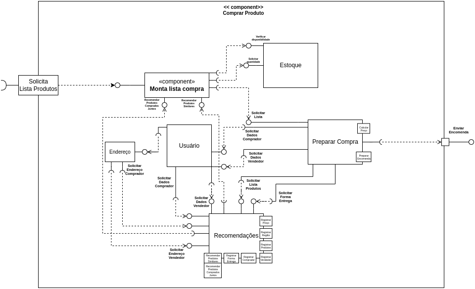

Detalhamento do componente comprar produto

O componente `Comprar produto` recebe como entrada a lista de produtos e o mesmo tem como saída a encomenda enviada.

1. O subcomponente `Monta lista compra` solicita para o subcomponente de `estoque` a quantidade disponível dos itens correntes no carinho de compras. Caso um produto esteja indisponível, isso fica marcado para informar o usuário.
2. O subcomponente `Monta lista compra` solicita o subcomponente de `Recomendações` diversas recomendações baseadas em diversos critérios como itens comprados normalmente juntos, produtos do mesmo vendedor, promoções como entrega grátis. Esse subcomponente utiliza modelos preditivos de aprendizado de maquina (machine learning) alimentado de dados históricos de compras para recomendar os produtos.

Enquanto o usuário adiciona ou retira itens do carrinho de compras os passos 1 e 2 são constantemente executados.

Se o usuário selecionar a opção de finalizar a compra o subcomponente `preparar compra` solicita a lista final de itens para o subcomponente `Monta lista de compras`. Para obter dados da compra o subcomponente `Usuario` é acionado para obter dados do vendedor e comprador como endereço e solicita ao usuário a forma de pagamento.

### Detalhamento da interação de componentes

* subcomponente `Monta lista compra` assina o tópico `monta/compra/+/id`
* subcomponente `Estoque` assina o tópico `estoque/produto/+/id`
* subcomponente `Recomendações` assina os tópicos "recomendacoes/{tipo_recomendacao}/+/id" onde `tipo_recomendacao`pode ser produtos similares, produtos tipicamente comprados juntos, produtos do mesmo vendedor, produtos que geram promoções e etc ...
* subcomponente `Preparar Compra` assina o tópico `prepara/compra/+/id`
* subcomponente `Usuario` assina o tópico `usuario/vendedor/+/id` e `usuario/comprador/+/id`
* subcomponente `Endereço` assina o tópico `endereco/usuario/+/id`

## Componente `Recomendações`

> *Recomendações* é responsável por várias vertentes do Machine Learning, relacionando a compra/venda, produtos, região de entrega e forma de entrega, sendo elas:
> * Registrar Formas de Entrega
> * Registrar Comprador/Vendedor que é um Usuário
> * Registrar Lista de Produtos
> * Registrar Preco total
> * Registrar Região

## Componente `Solicita Lista Produtos`

> Componente responsável em entregar lista de produtos atualizados da compra.

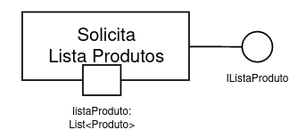

## Componente `Monta Lista Produtos`

> Componente responsável em montar a lista, com o que o usuário provê e as recomendações que são providas durante a constante atualização
> da lista de produtos utilizando as informações como Produtos, Região de entrega, Vendedor, Comprador.

## Componente `Usuário`

> Componente que entrega os dados do Usuario, sendo ele comprador ou vendedor

## Componente `Endereço`

> Componente que entrega os endereços, relacionando ao Usuario

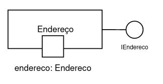

## Componente `Preparar Compra`

> Este componente é responsável em preparar a compra.
> * Preparar recomendações e apresentar ao usuário
> * Preparar envio, relacionando usuário, endereço para entrega
> * Preparar lista de produtos com quantidade
> * Calcular preço total
> * Na confirmação, preparar encomenda.

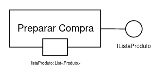

## Componente `Estoque`

> Controlador de estoque, verificando disponibilidade e quantidade.
> * Verifica disponibilidade de estoque.
> * Verifica quantidade do estoque.

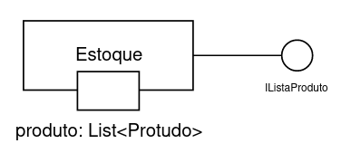

## Componente `Encomenda`

> Prepara todas as informações, produtos, dados para a encomenda.
> * Cria uma encomenda para enviar as compras.

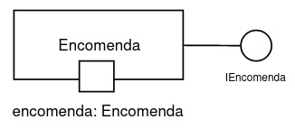

**Interfaces**
> Listagem das interfaces do componente.

* IListaProduto
* IUsuario
* IEndereco
* ILearningMachine
* IEncomenda

## Detalhamento das Interfaces

### Interface `ILearningMachine`

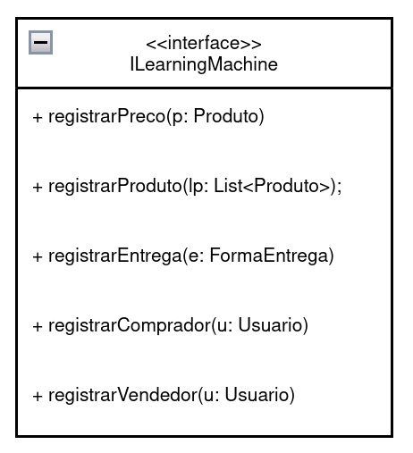

> Sistema que está sempre relacionando informações para criar relações de compra, vendedor
> para criar recomendações.

Método | Objetivo
-------| --------
`registrarPreco` | `Registra preços dos produtos`
`registrarProduto` | `Registra Produtos da compra para relacionar`
`registrarComprador` | `Registrar Comprador e dados`
`registrarVendedor` | `Registrar Vendedor e dados`
`registrarEntrega` | `Registrar forma de entrega da compra`

### Interface `IEncomenda`

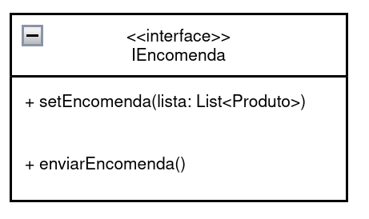

> Expõe funções para criar encomenda e pedir para enviar.

Método | Objetivo
-------| --------
`setEncomenda` | `Cria encomenda com lista de produto e usuário`
`enviaEncomenda` | `Gera a encomenda e cria uma nova encomenda para envio.`

### Interface `IListaProduto`

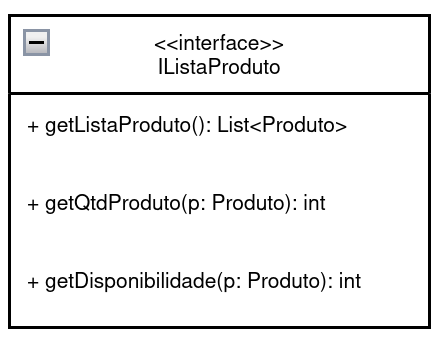

> Expõe funções para lista de produtos.

Método | Objetivo
-------| --------
`getListaProduto` | `retorna lista de produto`
`getQtdProduto` | `retorna quantidade de produtos disponíveis através do Estoque`
`getDisponibilidade` | `retorna disponibilidade do produto através do Estoque`

### Interface `IUsuario`

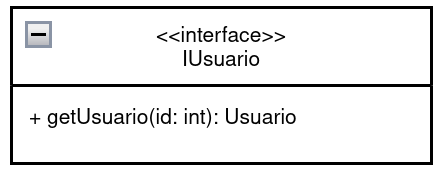

> Retorna Usuario.

Método | Objetivo
-------| --------
`getUsuario` | `Retorna objeto Usuario para a instância`

### Interface `IEndereco`

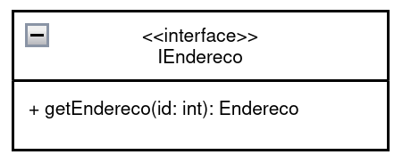

> Responsável em retornar endereço do usuário.

Método | Objetivo
-------| --------
`getEndereco` | `retorna endereço registrado no Usuario`

### UML dos Componentes unificado

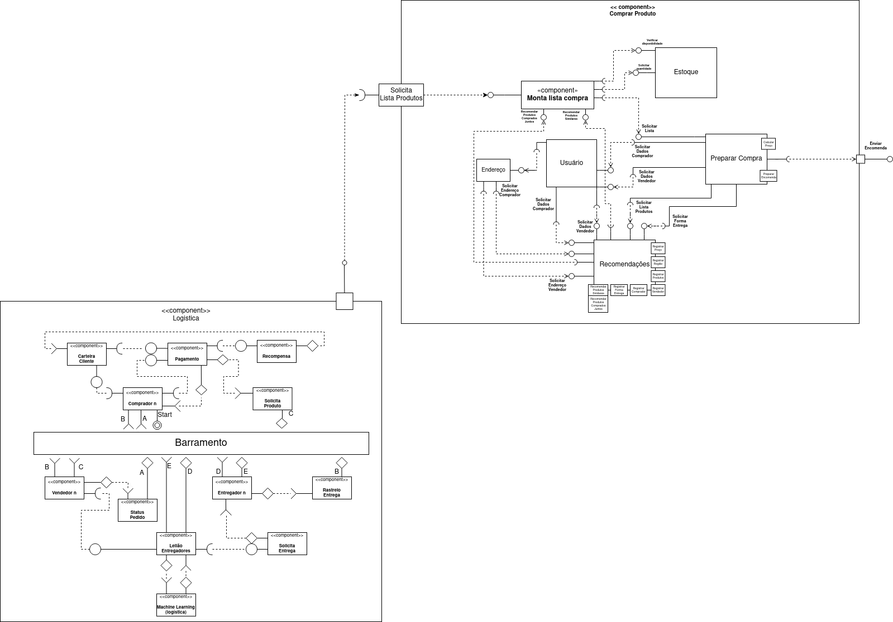

## Diagrama do Nível 3

### Caputura tela de pagamento

### Caputura tela de entrega

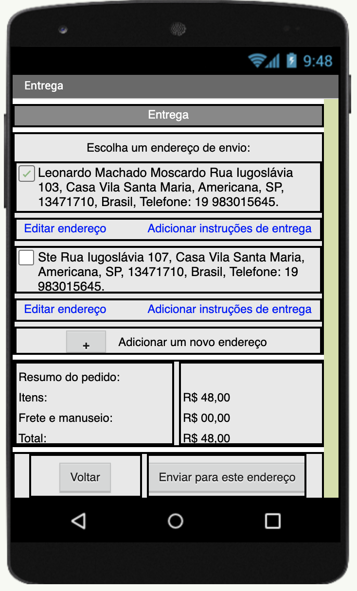

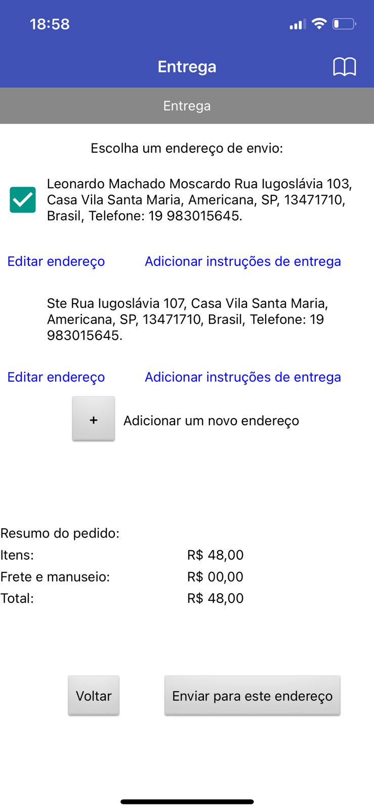

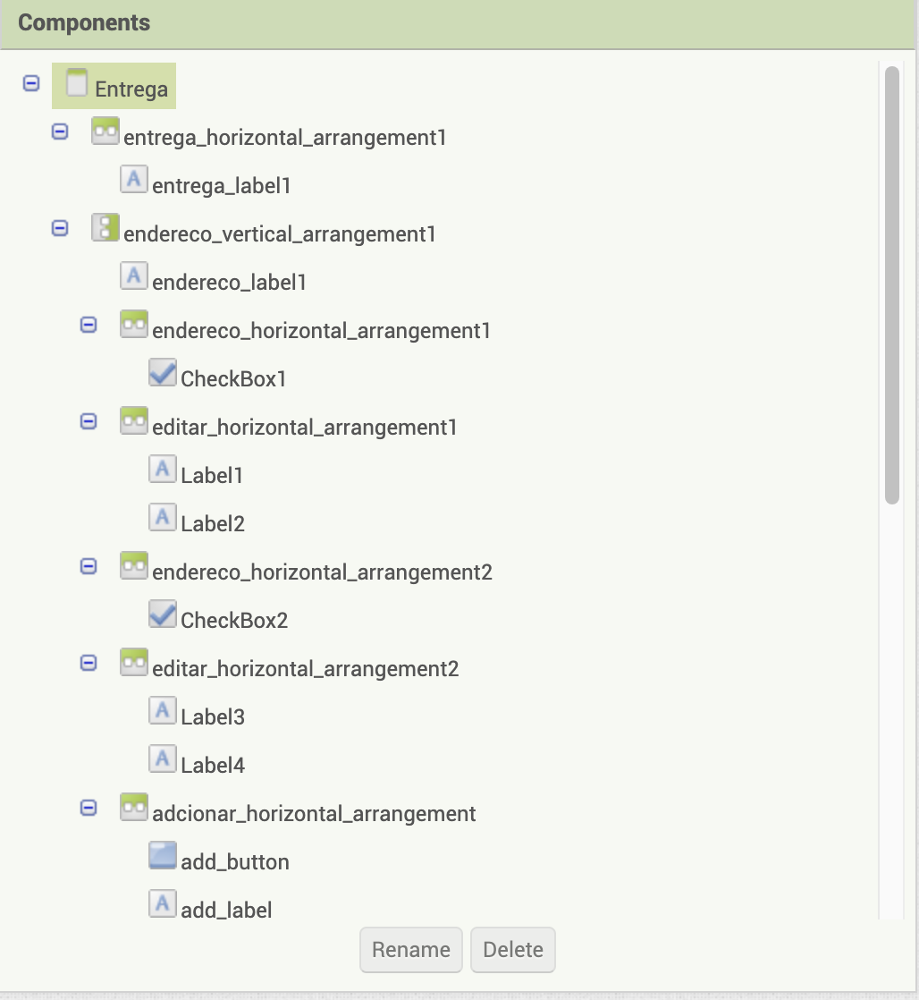

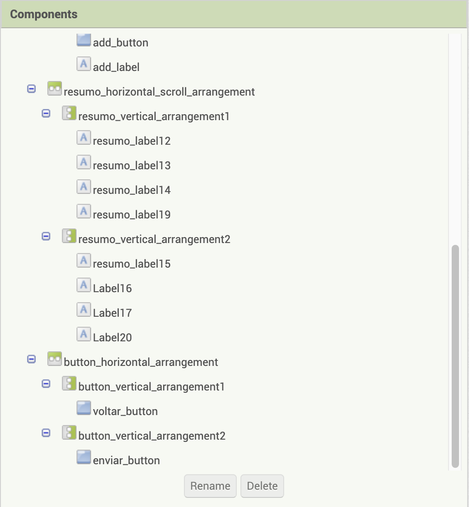

### Caputura tela de diagrama referente ao protótipo

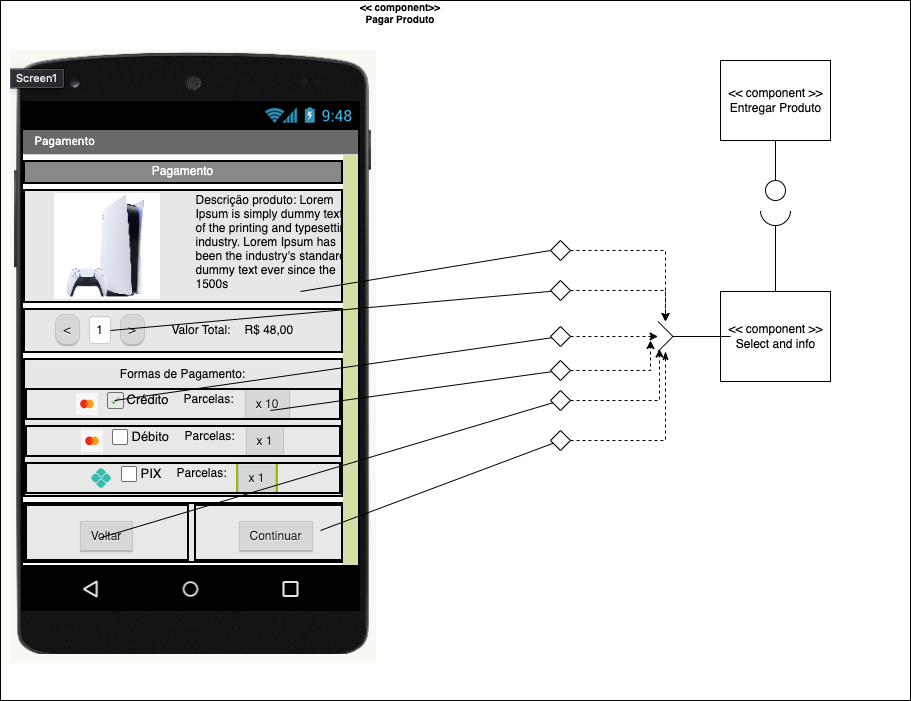

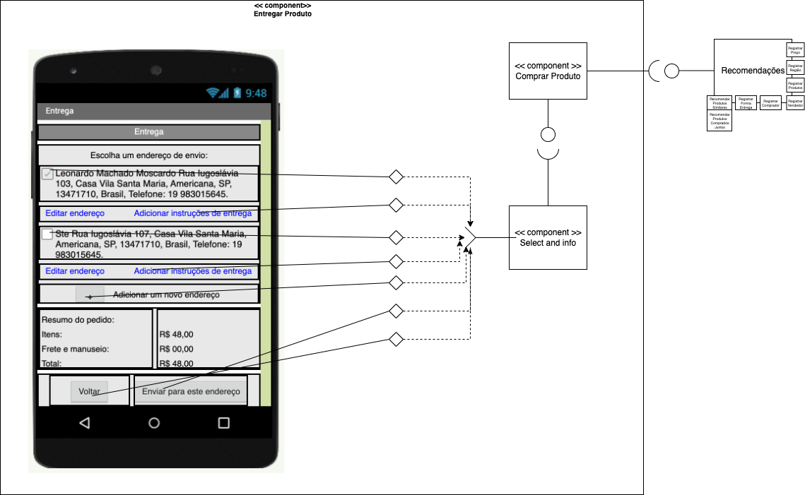

### Detalhamento da interação de componentes

O componente é composto por duas telas, sendo a tela de pagamento como solicitado e a tela de entrega.
Tela de pagamentos: é composta pelos compontes de descrição do produto, quantidade, valor total e forma de pagamento. Esses componentes geram informação para a próxima tela de entrega.
Tela de entrega: é composta pelos endereços já previamente cadastrados, componente de edição de endereço, adição de um novo endereço e finalização da compra. Ao finalizar a compra é enviado as informações de compra para o componente de recomendação, sendo o responsável por alimentar as informações para o aprendizado.
